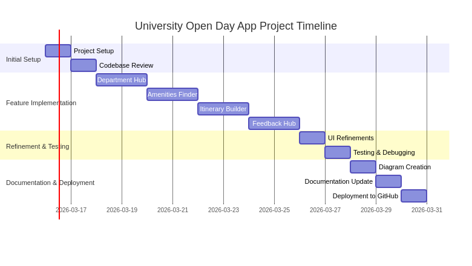
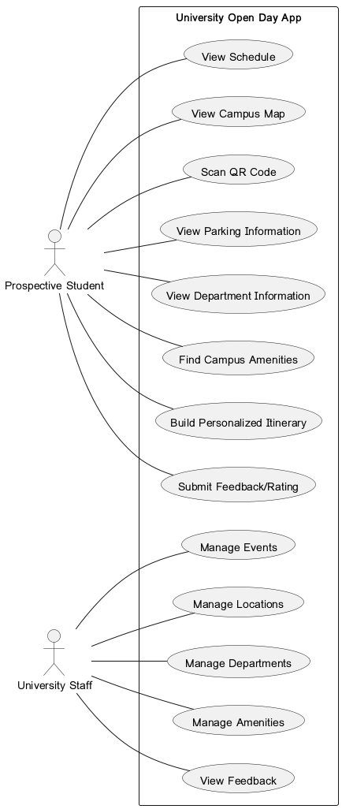
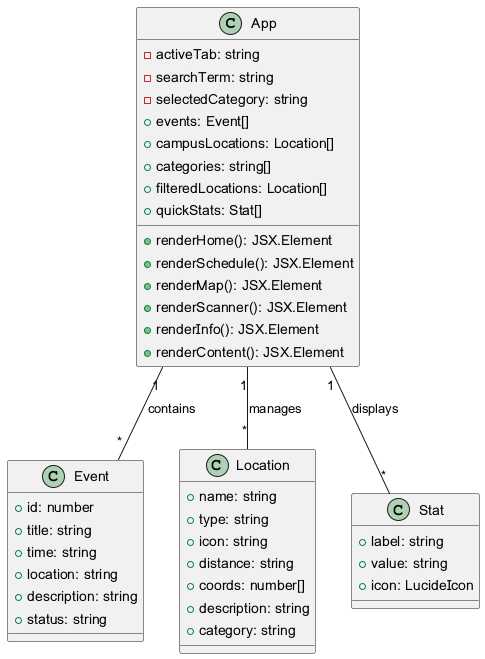

# Project Diagrams

This document contains various diagrams illustrating the structure and timeline of the University Open Day Application.

## Project Timeline (Gantt Chart)

The Gantt chart below provides a visual representation of the project timeline, outlining key phases and tasks.

## Use Case Diagram

The Use Case Diagram illustrates the interactions between users (actors) and the University Open Day Application, showing the different functionalities available.

## Class Diagram

The Class Diagram provides a high-level overview of the main components (classes) within the application and their relationships.

